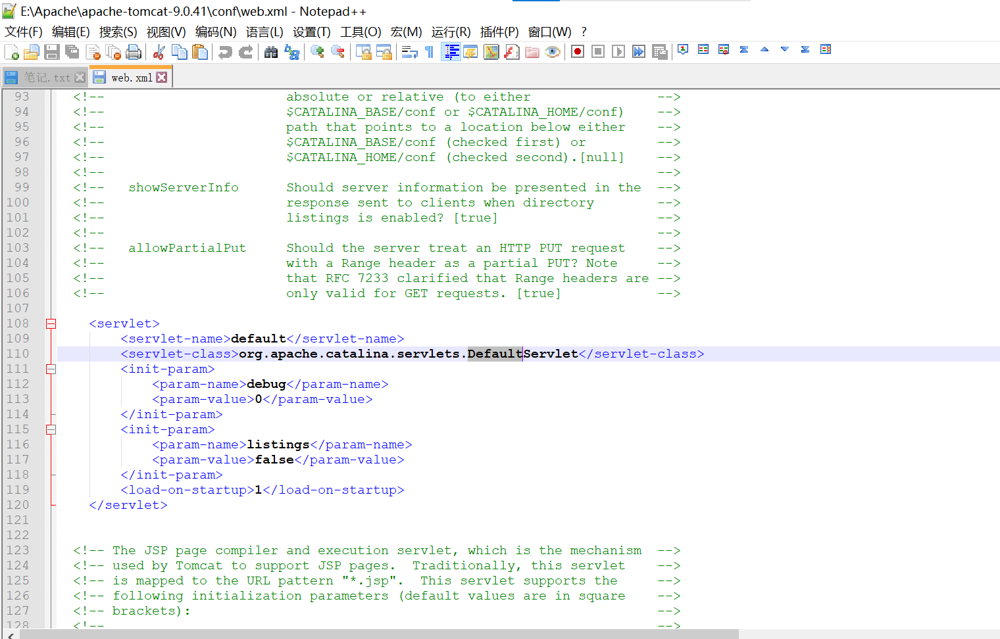
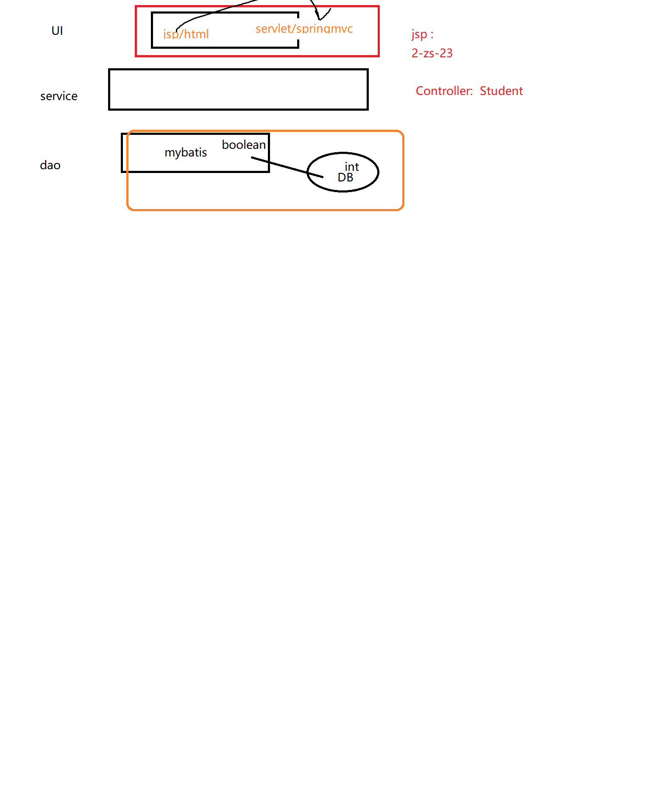

#视图解析器常见功能、处理静态资源、类相关转换器(P8)
##之前内容的概述:
>InternalResourceViewResolver其他功能：  

1. <mvc:view-controller ...>  
index.jsp -> Controller(@RequsetMapping("a")) ->succes.jsp

## 省略Controller(@RequsetMapping("a"))
>要用SpringMVC实现：index.jsp -> succes.jsp:  
`<mvc:view-controller path="a"   view-name="success" />`  
以上注解 ，会让所有的请求 转入<mvc:..>中匹配映射地址，而会忽略调@RequsetMapping()；
如果想让 @RequsetMapping("a")  和<mvc:..>共存，则需要加入一个注解：<mvc:annotation-driven></mvc:annotation-driven>

2. 指定请求方式
 - 指定跳转方式：
   - `return "forward:/views/success.jsp";`
 - forward(转发，url不变):   redirect(重定向，url变): 需要注意 此种方式，不会被视图解析器加上前缀(/views)、后缀(.jsp)

3. 处理静态资源：html css js  图片 视频  
>概念 
   - 动态资源:可以与用户交互、因为时间/地点的不同 而结果不同的内容：(百度：天气)
   - 静态：与用户无交互，什么时候看都是一样的。  
>在SpringMVC中，如果直接访问静态资源：404 。原因：之前将所有的请求 通过通配符“、” 拦截，进而交给 SPringMVC的入口DispatcherServlet去处理：找该请求映射对应的 @requestMapping
   - 请求http://localhost:8888/SpringMVCProject/img.png
   - springmvc认为有一个:  
       @RequsetMapping("img.png")
           return sucess  
>解决：如果是 需要mvc处理的，则交给@RequsetMapping("img.png")处理；如果不需要springmvc处理，则使用 tomcat默认的Servlet去处理。
- tomcat默认的Servlet去处理：如果有对应的请求拦截,则交给相应的Servlet去处理；如果没有对应的servlet，则直接访问。
- tomcat默认的Servlet在哪里？在tomcat配置文件\conf\web.xml中
>
    <servlet>
        <servlet-name>abc</servlet-name>
        <servlet-class>xxx.xxx.xx.ABCServlet</servlet-class>
    </servlet>
	
    <servlet-mapping>
        <servlet-name>abc</servlet-name>
        <url-pattern>/abc</url-pattern>
    </servlet-mapping>

>解决静态资源方案：如果有springmvc对应的@requestMapping则交给spring处理；如果没有对应@requestMapping,则交给服务器tomcat默认的servlet去处理  ：实现方法，只需要增加2个注解即可 springmvc.xml:  
<mvc:default-servlet-handler></mvc:default-servlet-handler>
<mvc:annotation-driven></mvc:annotation-driven>

>总结：要让springmvc访问静态资源，只需要加入以下2个注解：
- <mvc:default-servlet-handler></mvc:default-servlet-handler>
- <mvc:annotation-driven></mvc:annotation-driven>
- 静态资源在web容器中(webapp目录下)

4. 类型转换

a.Spring自带一些常见的类型转换器：
public String  testDelete(@PathVariable("id") String id) ，即可以接受int类型数据id  也可以接受String类型的id

b.可以自定义类型转换器(将jsp提供的请求数据中获取字符串到srpingmvc中获取到一个student！)  
i.编写 自定义类型转器的类 （实现Converter接口）  

    public class MyConverter  implements Converter<String,Student>{
        @Override
        public Student convert(String source) {//source:2-zs-23
            //source接受前端传来的String:2-zs-23
            String[] studentStrArr = source.split("-") ;
            Student student = new Student();
            student.setId(  Integer.parseInt(  studentStrArr[0]) );
            student.setName(studentStrArr[1]);
            student.setAge(Integer.parseInt(studentStrArr[2] ));
            return student;
        }
    
    }

>ii.配置：将MyConverter加入到springmvc中  
1. 将 自定义转换器 纳入SpringIOC容器  
`<bean  id="myConverter" class="org.lanqiao.converter.MyConverter"></bean>`
	
2. 将myConverter再纳入SpringMVC提供的转换器Bean(所有转换器都在此bean中进行注册！)   
`
    <bean id="conversionService"  class="org.springframework.context.support.ConversionServiceFactoryBean">
        <property name="converters">
            <set>
                <ref bean="myConverter"/>
            </set>
        </property>
    </bean>
    `
3. 将conversionService注册到annotation-driven中  
   - 此配置是SpringMVC的基础配置，很功能都需要通过该注解来协调  
   `<mvc:annotation-driven conversion-service="conversionService"></mvc:annotation-driven>`

4. 测试转换器:
`@RequestMapping(value="testConverter")  
public String testConverter(@RequestParam("studentInfo")  Student student) {// 前端：2-zs-23  
            System.out.println(student.getId()+","+student.getName()+","+student.getAge());  
            return "success";  
        }  
`

其中@RequestParam("studentInfo")是触发**转换器的桥梁**:  
@RequestParam("studentInfo")接受的数据 是前端传递过来的：2-zs-23，但是 需要将该数据复制给修饰的目的对象Student；
因此SpringMVC可以发现 接收的数据 和目标数据不一致，并且 这两种数据分别是 String、Student,正好符合public Student convert(String source)转换器,因此触发转换器！

5. 数据格式化
SimpleDateForamt sdf = new SimpleDateFormat("yyyy-MM-dd  hh:mm:ss");
SpringMVC提供了很多注解，方便我们数据格式化
实现步骤：
a.配置
<!-- 配置 数据格式化 注解 所依赖的bean -->
`<bean id="conversionService" class="org.springframework.format.support.FormattingConversionServiceFactoryBean">  
</bean>`

b.通过注解使用
`@DateTimeFormat(pattern="yyyy-MM-dd")  
@NumberFormat(parttern="###,#")`只适合字符串
>注解：FormattingConversionServiceFactoryBean即包含格式化又包含类型转换ConversionServiceFactoryBean

## 错误信息处理
1. 错误消息：
`public String testDateTimeFormat(Student student, BindingResult result ,Map<String,Object> map) {`
需要验证的数据是 Student中的birthday, SpringMVC要求 如果校验失败  则将错误信息 自动放入 该对象之后紧挨着的	BindingResult中。
即Student student, BindingResult result之间 不能有其他参数。

> 如果要将控制台的错误消息 传到jsp中显示，则可以将 错误消息对象放入request域中，然后 在jsp中 从request中获取。

2. 数据校验   
   JSR303  
   Hibernate Validator

使用Hibernate Validator步骤：

a.jar（注意各个jar之间可能存在版本不兼容）
hibernate-validator-5.0.0.CR2.jar 	classmate-0.8.0.jar 	jboss-logging-3.1.1.GA.jar
validation-api-1.1.0.CR1.jar 	hibernate-validator-annotation-processor-5.0.0.CR2.jar

b配置
<mvc:annotation-driven ></mvc:annotation-driven>
此时mvc:annotation-driven的作用：要实现Hibernate Validator/JSR303 校验（或者其他各种校验），必须实现SpringMVC提供的一个接口：ValidatorFactory

LocalValidatorFactoryBean是ValidatorFactory的一个实现类。
<mvc:annotation-driven ></mvc:annotation-driven>会在springmvc容器中 自动加载一个LocalValidatorFactoryBean类，因此可以直接实现数据校验。

c.直接使用注解

public class Student {

	@Past//当前时间以前
	private Date birthday ;
}

在校验的Controller中 ，给校验的对象前增加 @Valid
public String testDateTimeFormat(@Valid Student student, BindingResult result ,Map<String,Object> map) {
{...}

3.Ajax请求SpringMVC，并且JSON格式的数据
a.jar
jackson-annotations-2.8.9.jar
jackson-core-2.8.9.jar
jackson-databind-2.8.9.jar

b。
@ResponseBod修饰的方法，会将该方法的返回值 以一个json数组的形式返回给前台

@ResponseBody//告诉SpringMVC，此时的返回 不是一个 View页面，而是一个 ajax调用的返回值（Json数组）
@RequestMapping(value="testJson")
public List<Student> testJson() {
//Controller-Service-dao
//StudentService studentService = new StudentServiceImp();
//			List<Student> students =  studentService.qeuryAllStudent();
//模拟调用service的查询操作

			...
			List<Student> students = new ArrayList<>();
			students.add(stu1) ;
			students.add(stu2) ;
			students.add(stu3) ;
			
			return students;
		}

前台：服务端将返回值结果 以json数组的形式 传给了result。
$("#testJson").click(function(){
//通过ajax请求springmvc
$.post(
"handler/testJson",//服务器地址
//{"name":"zs","age":23}
function(result){//服务端处理完毕后的回调函数 List<Student> students， 加上@ResponseBody后， students实质是一个json数组的格式
for(var i=0;i<result.length ;i++){
alert(result[i].id +"-"+result[i].name +"-"+result[i].age);
}
}
);

