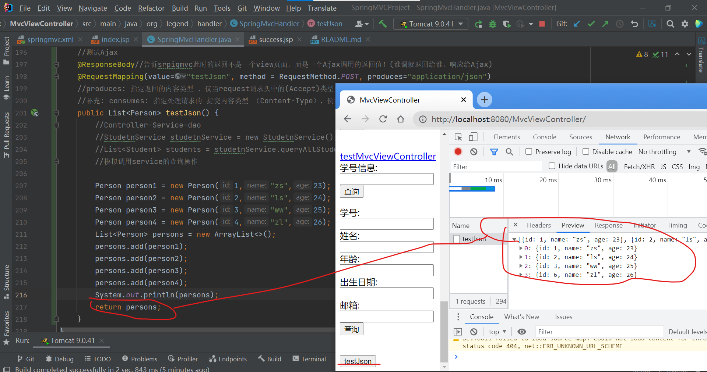
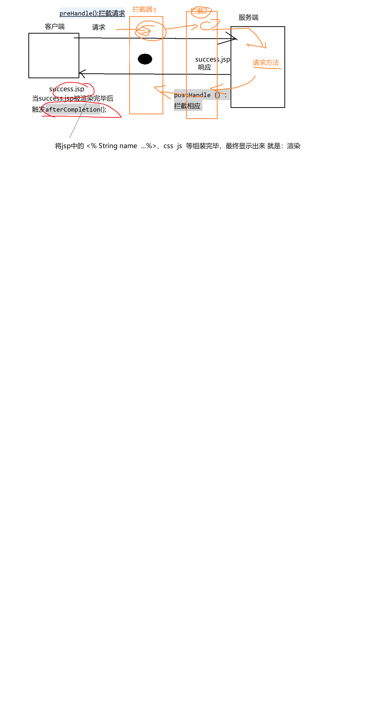

#视图解析器常见功能、处理静态资源、类相关转换器(P8)
##之前内容的概述:
>InternalResourceViewResolver其他功能：  

1. <mvc:view-controller ...>  
index.jsp -> Controller(@RequsetMapping("a")) ->succes.jsp

## 省略Controller(@RequsetMapping("a"))
>要用SpringMVC实现：index.jsp -> succes.jsp:  
`<mvc:view-controller path="a"   view-name="success" />`  
以上注解 ，会让所有的请求 转入<mvc:..>中匹配映射地址，而会忽略调@RequsetMapping()；
如果想让 @RequsetMapping("a")  和<mvc:..>共存，则需要加入一个注解：<mvc:annotation-driven></mvc:annotation-driven>

2. 指定请求方式
 - 指定跳转方式：
   - `return "forward:/views/success.jsp";`
 - forward(转发，url不变):   redirect(重定向，url变): 需要注意 此种方式，不会被视图解析器加上前缀(/views)、后缀(.jsp)

3. 处理静态资源：html css js  图片 视频  
>概念 
   - 动态资源:可以与用户交互、因为时间/地点的不同 而结果不同的内容：(百度：天气)
   - 静态：与用户无交互，什么时候看都是一样的。  
>在SpringMVC中，如果直接访问静态资源：404 。原因：之前将所有的请求 通过通配符“、” 拦截，进而交给 SPringMVC的入口DispatcherServlet去处理：找该请求映射对应的 @requestMapping
   - 请求http://localhost:8888/SpringMVCProject/img.png
   - springmvc认为有一个:  
       @RequsetMapping("img.png")
           return sucess  
>解决：如果是 需要mvc处理的，则交给@RequsetMapping("img.png")处理；如果不需要springmvc处理，则使用 tomcat默认的Servlet去处理。
- tomcat默认的Servlet去处理：如果有对应的请求拦截,则交给相应的Servlet去处理；如果没有对应的servlet，则直接访问。
- tomcat默认的Servlet在哪里？在tomcat配置文件\conf\web.xml中
>
    <servlet>
        <servlet-name>abc</servlet-name>
        <servlet-class>xxx.xxx.xx.ABCServlet</servlet-class>
    </servlet>
	
    <servlet-mapping>
        <servlet-name>abc</servlet-name>
        <url-pattern>/abc</url-pattern>
    </servlet-mapping>

>解决静态资源方案：如果有springmvc对应的@requestMapping则交给spring处理；如果没有对应@requestMapping,则交给服务器tomcat默认的servlet去处理  ：实现方法，只需要增加2个注解即可 springmvc.xml:  
<mvc:default-servlet-handler></mvc:default-servlet-handler>
<mvc:annotation-driven></mvc:annotation-driven>

>总结：要让springmvc访问静态资源，只需要加入以下2个注解：
- <mvc:default-servlet-handler></mvc:default-servlet-handler>
- <mvc:annotation-driven></mvc:annotation-driven>
- 静态资源在web容器中(webapp目录下)

4. 类型转换

a.Spring自带一些常见的类型转换器：
public String  testDelete(@PathVariable("id") String id) ，即可以接受int类型数据id  也可以接受String类型的id

b.可以自定义类型转换器(将jsp提供的请求数据中获取字符串到srpingmvc中获取到一个student！)  
i.编写 自定义类型转器的类 （实现Converter接口）  

    public class MyConverter  implements Converter<String,Student>{
        @Override
        public Student convert(String source) {//source:2-zs-23
            //source接受前端传来的String:2-zs-23
            String[] studentStrArr = source.split("-") ;
            Student student = new Student();
            student.setId(  Integer.parseInt(  studentStrArr[0]) );
            student.setName(studentStrArr[1]);
            student.setAge(Integer.parseInt(studentStrArr[2] ));
            return student;
        }
    
    }

>ii.配置：将MyConverter加入到springmvc中  
1. 将 自定义转换器 纳入SpringIOC容器  
`<bean  id="myConverter" class="org.lanqiao.converter.MyConverter"></bean>`
	
2. 将myConverter再纳入SpringMVC提供的转换器Bean(所有转换器都在此bean中进行注册！)   
`
    <bean id="conversionService"  class="org.springframework.context.support.ConversionServiceFactoryBean">
        <property name="converters">
            <set>
                <ref bean="myConverter"/>
            </set>
        </property>
    </bean>
    `
3. 将conversionService注册到annotation-driven中  
   - 此配置是SpringMVC的基础配置，很功能都需要通过该注解来协调  
   `<mvc:annotation-driven conversion-service="conversionService"></mvc:annotation-driven>`

4. 测试转换器:
`@RequestMapping(value="testConverter")  
public String testConverter(@RequestParam("studentInfo")  Student student) {// 前端：2-zs-23  
            System.out.println(student.getId()+","+student.getName()+","+student.getAge());  
            return "success";  
        }  
`

其中@RequestParam("studentInfo")是触发**转换器的桥梁**:  
@RequestParam("studentInfo")接受的数据 是前端传递过来的：2-zs-23，但是 需要将该数据复制给修饰的目的对象Student；
因此SpringMVC可以发现 接收的数据 和目标数据不一致，并且 这两种数据分别是 String、Student,正好符合public Student convert(String source)转换器,因此触发转换器！

5. 数据格式化
SimpleDateForamt sdf = new SimpleDateFormat("yyyy-MM-dd  hh:mm:ss");
SpringMVC提供了很多注解，方便我们数据格式化
实现步骤：
a.配置
<!-- 配置 数据格式化 注解 所依赖的bean -->
`<bean id="conversionService" class="org.springframework.format.support.FormattingConversionServiceFactoryBean">  
</bean>`

b.通过注解使用
`@DateTimeFormat(pattern="yyyy-MM-dd")  
@NumberFormat(parttern="###,#")`只适合字符串
>注解：FormattingConversionServiceFactoryBean即包含格式化又包含类型转换ConversionServiceFactoryBean

## 错误信息处理
1. 错误消息：
`public String testDateTimeFormat(Student student, BindingResult result ,Map<String,Object> map) {`
- 需要验证的数据是 Student中的birthday, SpringMVC要求 如果校验失败则将错误信息自动放入 该对象之后紧挨着的BindingResult中。即Student student, BindingResult result之间 不能有其他参数。
- (前端显示错误信息)如果要将控制台的错误消息 传到jsp中显示，则可以将 错误消息对象放入request域中，然后 在jsp中 从request中获取。

> 注:后续通过maven导入jstsl包，可能没有导出Tomcat的lib中可以在Artifact中检查WEB-INF/lib;如果没有则在Artifact中重新部署项目包！

2. 数据校验
- JSR303

- Hibernate Validator:包含JSR303,是对JSR303的扩展

使用Hibernate Validator步骤：

a.所需jar包（注意各个jar之间可能存在版本不兼容）  
hibernate-validator-6.2.0.Final.jar  
classmate-1.5.1.jar  
jboss-logging-3.4.1.Final.jar  
jakarta.validation-api-2.0.2.jar  
hibernate-validator-annotation-processor-6.2.0.Final.jar  

b.配置  
`<mvc:annotation-driven ></mvc:annotation-driven>`  
>此时mvc:annotation-driven的作用：
- 要实现Hibernate Validator/JSR303 校验（或者其他各种校验），必须实现SpringMVC提供的一个接口：ValidatorFactory  
- LocalValidatorFactoryBean是ValidatorFactory的一个实现类。  
- <mvc:annotation-driven ></mvc:annotation-driven>会在springmvc容器中 自动加载一个LocalValidatorFactoryBean类，因此可以直接实现数据校验。

c.
- 直接使用注解  
`public class Student {
    @Past//当前时间以前
    private Date birthday ;
}`
- 在校验的Controller中 ，给校验的对象前增加 @Valid，就会在对象里的Hibernate Validator注释进行校验
`public String testDateTimeFormat(@Valid Student student, BindingResult result ,Map<String,Object> map) {
{...}`

3. Ajax请求SpringMVC，并且JSON格式的数据
a.导入相关jar
- jackson-annotations-2.13.0.jar
- jackson-core-2.13.0.jar
- jackson-databind-2.13.0.jar

b.
>@ResponseBody修饰的方法，会将该方法的返回值 以一个json数组的形式返回给前台

`@ResponseBody//告诉SpringMVC，此时的返回 不是一个 View页面，而是一个 ajax调用的返回值（Json数组）  
@RequestMapping(value="testJson")  
public List<Student> testJson() {  
//Controller-Service-dao  
//StudentService studentService = new StudentServiceImp();  
//			List<Student> students =  studentService.qeuryAllStudent();  
//模拟调用service的查询操作`  

			`...  
			List<Student> students = new ArrayList<>();  
			students.add(stu1) ;  
			students.add(stu2) ;  
			students.add(stu3) ;  
			
			return students;
		}
`
> 前台：服务端将返回值结果 以json数组的形式 传给了result。
`
$("#testJson").click(function(){  
//通过ajax请求springmvc  
$.post(  
"handler/testJson",//服务器地址  
//{"name":"zs","age":23}  
function(result){//服务端处理完毕后的回调函数 List<Student> students， 加上@ResponseBody后， students实质是一个json数组的格式  
for(var i=0;i<result.length ;i++){  
alert(result[i].id +"-"+result[i].name +"-"+result[i].age);  
}  
}  
);`

## SpringMVC实现文件上传：
> ——前提  
上传过程: 页面-->内存-->本地磁盘
> 和Servlet方式的本质一样，都是通过commons-fileupload.jar和commons-io.jar
SpringMVC可以简化文件上传的代码，但是必须满足条件：实现MultipartResolver接口 ；而该接口的实现类SpringMVC也已经提供了CommonsMultipartResolver

### 具体步骤：
1. 导入相关jar包
- commons-fileupload.jar
- commons-io.jar 
2. 配置CommonsMultipartResolver
  - 将其加入SpringIOC容器

	<bean id="multipartResolver" class="org.springframework.web.multipart.commons.CommonsMultipartResolver">  
			<property name="defaultEncoding" value="UTF-8"></property>  
			<!-- 上传单个文件的最大值，单位Byte;如果-1，表示无限制 -->  
			<property name="maxUploadSize"  value="102400"></property>  
	</bean>

3. 处理方法
//文件上传处理方法  
`@RequestMapping(value="testUpload") //abc.png`    
`public String testUpload(@RequestParam("desc") String desc  , @RequestParam("file") MultipartFile file  ) throws IOException {`  
            `
            System.out.println("文件描述信息："+desc);`  
            //jsp中上传的文件：file  
            `
            InputStream input = file.getInputStream() ;//IO`  
            `String fileName = file.getOriginalFilename() ;`  
            `
            OutputStream out = new FileOutputStream("d:\\"+fileName) ;`  
            `
            byte[] bs = new byte[1024];`  
            `int len = -1;`  
            `while(( len = input.read(bs)) !=-1 ) {`  
                `out.write(bs, 0, len);`  
            `}`  
            `out.close();`  
            `input.close();`  
            //将file上传到服务器中的 某一个硬盘文件中
        `System.out.println("上传成功！");`
            `return "success";`  
        `}`
    
    `<form action="handler/testUpload" method="post"  enctype="multipart/form-data">`  
        `<input type="file" name="file" />`  
        `描述:<input name="desc" type="text" />`  
        `<input type="submit" value="上传">`  
    `</form>`  

> 框架:   将原来自己写的1000行代码，变成：框架帮你写900行，剩下100行自己写
    控制器：handler  servlet   controller   action

## 拦截器
    拦截器的原理和过滤器相同。

> SpringMVC：要想实现拦截器，必须实现一个接口HandlerInterceptor

- ctrl+shift+r ：自己编写的代码.java  .jsp .html
- ctrl+shift+t ：jar中的代码

1. 编写拦截器implements HandlerInterceptor
2. 配置：将自己写的拦截器 配置到springmvc中（spring）

### 拦截器串过程
> 拦截器1拦截请求- 拦截器2拦截请求 - 请求方法 - 拦截器2处理相应-拦截器1处理相应  - 只会被 最后一个拦截器的afterCompletion()拦截

> 如果有多个拦截器，则每个拦截器的preHandle postHandle 都会在相应时机各被触发一次；但是afterCompletion， 只会执行最后一个拦截器的该方法（实际两个皆会触发！！！）。

3. 异常处理
>SpringMVC：  HandlerExceptionResolver接口,该接口的每个实现类都是异常的一种处理方式：
- ExceptionHandlerExceptionResolver: 主要提供了@ExceptionHandler注解，并通过该注解处理异常  
    //该方法 可以捕获本类中  抛出的ArithmeticException异常
    

    @ExceptionHandler({ArithmeticException.class,ArrayIndexOutOfBoundsException.class  })
    public String handlerArithmeticException(Exception e) {
        System.out.println(e +"============");
        return "error" ;
    }
@ExceptionHandler标识的方法的参数 必须在异常类型(Throwable或其子类) ，不能包含其他类型的参数  

异常处理路径：最短优先  
如果有方法抛出一个ArithmeticException异常，而该类中 有2个对应的异常处理法你发：

@ExceptionHandler({Exception.class  })
public ModelAndView handlerArithmeticException2(Exception e) {}

	@ExceptionHandler({ArithmeticException.class  })
	public ModelAndView handlerArithmeticException1(Exception e) {}
则优先级：  最短优先。

@ExceptionHandler默认只能捕获 当前类中的异常方法。
如果发生异常的方法  和处理异常的方法 不在同一个类中：@ControllerAdvice

总结：如果一个方法用于处理异常，并且只处理当前类中的异常：@ExceptionHandler
如果一个方法用于处理异常，并且处理所有类中的异常： 类前加@ControllerAdvice、 处理异常的方法前加@ExceptionHandler

b.
ResponseStatusExceptionResolver：自定义异常显示页面 @ResponseStatus

@ResponseStatus(value=HttpStatus.FORBIDDEN,reason="数组越界222!!!")
public class MyArrayIndexOutofBoundsException extends Exception {//自定义异常

}

@ResponseStatus也可以标志在方法前：
@RequestMapping("testMyException")
public String testMyException(@RequestParam("i") Integer i) throws MyArrayIndexOutofBoundsException {
if(i == 3) {
throw new MyArrayIndexOutofBoundsException();//抛出异常
}
return "success" ;
}

	@RequestMapping("testMyException2")
	public String testMyException2(@RequestParam("i") Integer i) {
		if(i == 3) {
			return "redirect:testResponseStatus" ;//跳转到某一个 异常处理方法里
		}
		return "success" ;
	}

