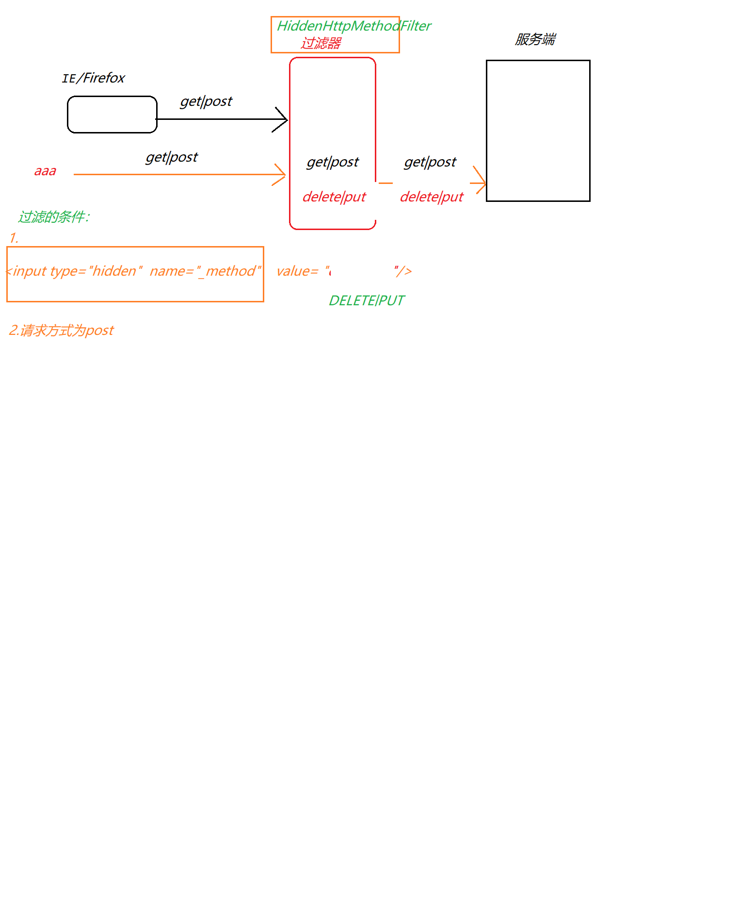
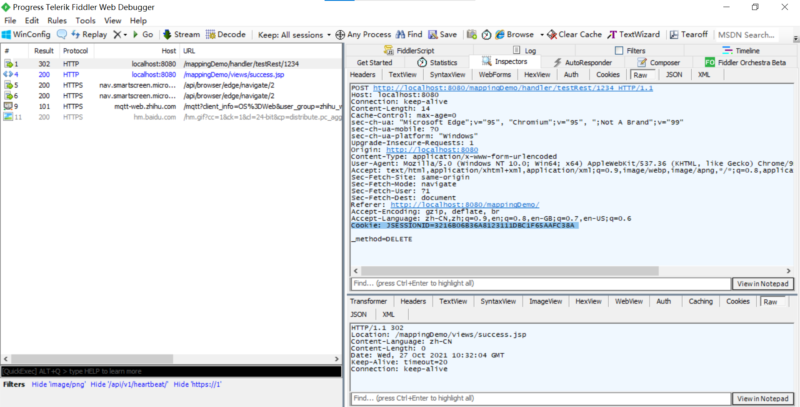
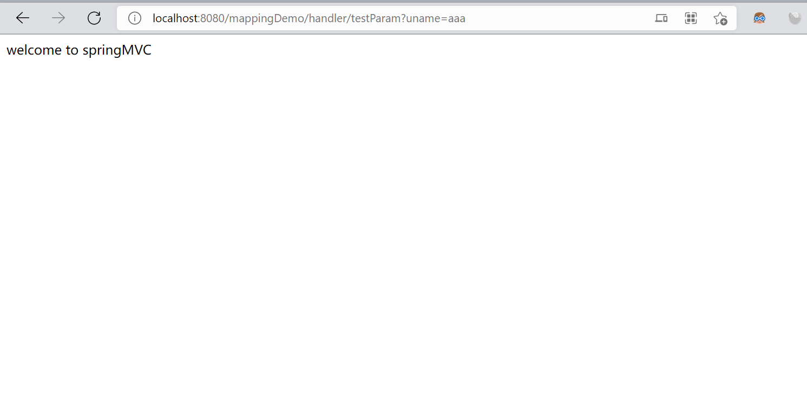
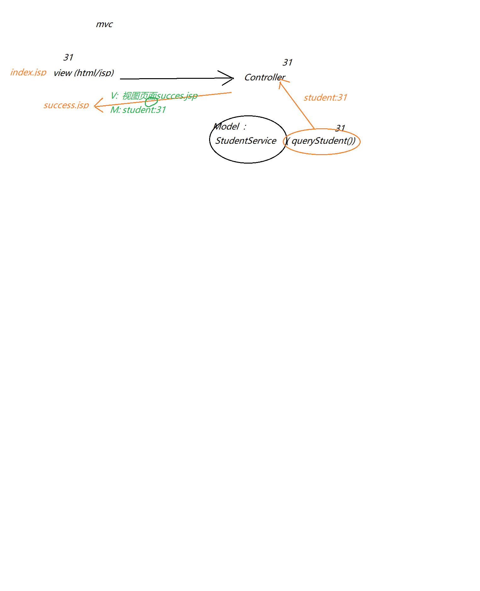
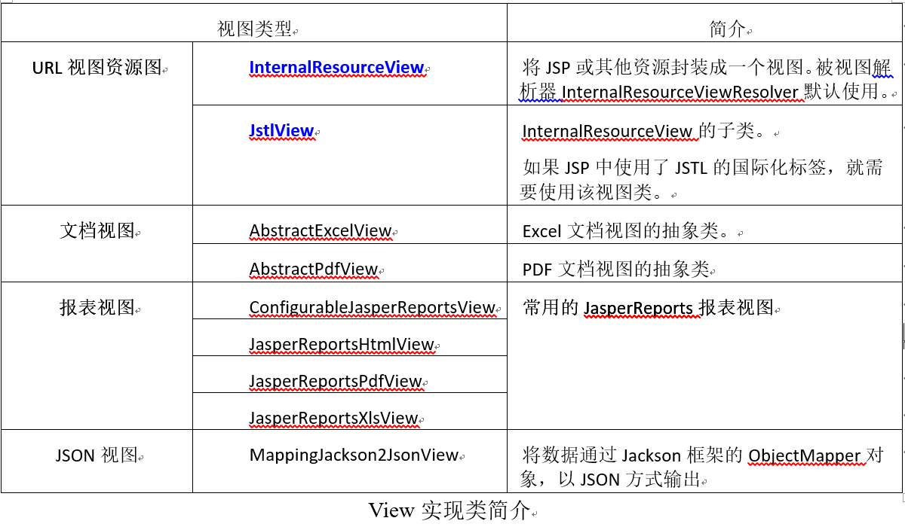
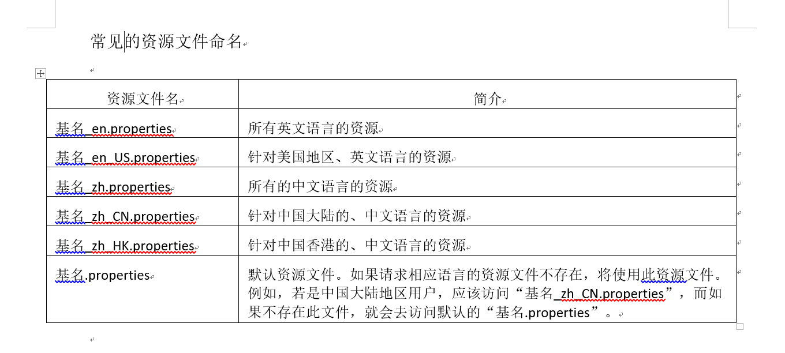
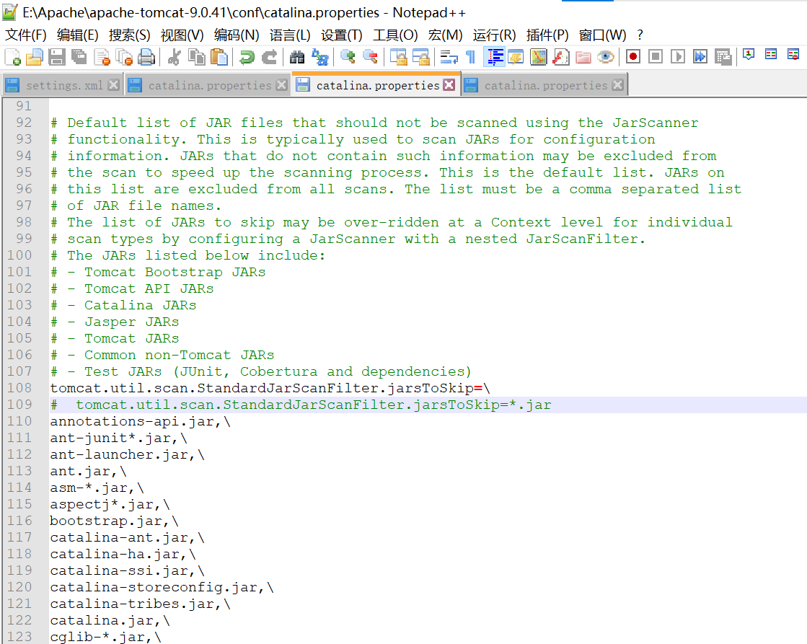
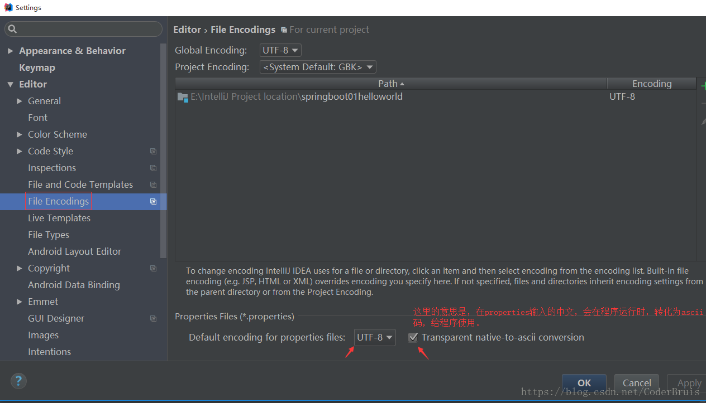
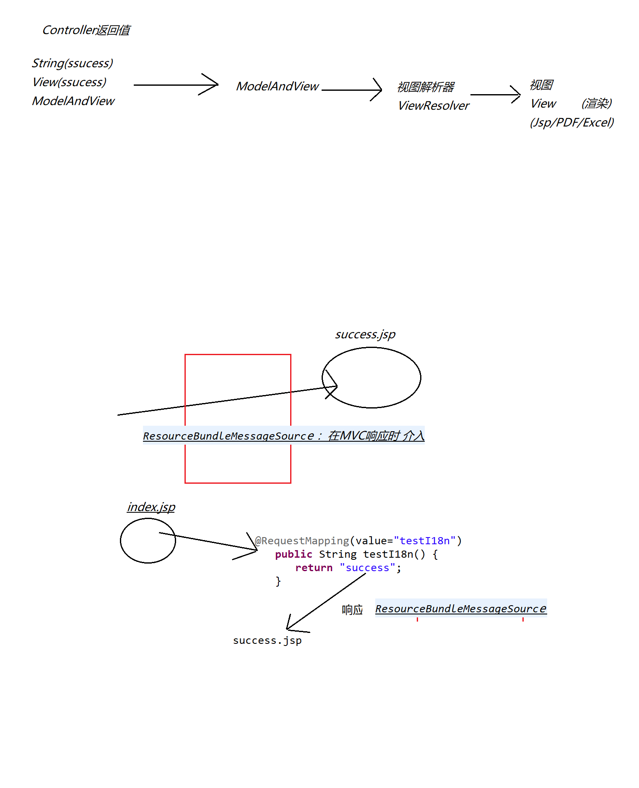

# springmvc:(P1)
1. jar
- spring-aop.jar
- spring-bean.jar
- spring-context.jar
- spring-core.jar
- spring-web.jar 
- spring-webmvc.jar 
- commons-logging.jar

报错NoClassDefFoundError：缺少jar

2. 第一个SpringMVC程序
- Servet - Springmvc
- jsp ->Servlet (Springmvc)->Jsp

url

- springmvc配置文件 springmvc.xml
  - 选中常用的命名空间：beans  aop context  mvc

- 普通的servlet流程：
  - 请求-url-pattern -交给对应的servlet去处理

>如果现在想用springmvc，而不是普通的servlet，如何告知程序？-如何让springmvc 介入程序：
需要配置一个 Springmvc自带的servlet

通过以下配置，拦截所有请求，交给SpringMVC处理：
>
    <servlet>  
        <servlet-name>springDispatcherServlet</servlet-name>  
        <servlet-class>org.springframework.web.servlet.DispatcherServlet</servlet-class>  
        <init-param>  
            <param-name>contextConfigLocation</param-name>  
            <param-value>classpath:springmvc.xml</param-value>  
        </init-param>  
        <load-on-startup>1</load-on-startup>  
    </servlet>`

  `<servlet-mapping>
  	<servlet-name>springDispatcherServlet</servlet-name>
  	<url-pattern>/</url-pattern>
  </servlet-mapping>`

>其中：  
<url-pattern>.action</url-pattern>

>/:一切请求  ，注意不是 /*
/user:拦截(接收)以 /user开头的请求
/user/abc.do  :只拦截该请求
.action:只拦截(接收) .action结尾的请求

>项目中同时兼容 springMVC和Servlet  
<servlet-mapping>  
<servlet-name>springDispatcherServlet</servlet-name>  
<url-pattern>.action</url-pattern>  
</servlet-mapping>  

> 
    <servlet>
        <servlet-name>springDispatcherServlet</servlet-name>
        <servlet-class>org.springframework.web.servlet.DispatcherServlet</servlet-class>
        <init-param>
                <param-name>contextConfigLocation</param-name>
                <param-value>classpath:springmvc.xml</param-value>
        </init-param>
        <load-on-startup>1</load-on-startup>
      </servlet>
通过  

 	<init-param>
  			<param-name>contextConfigLocation</param-name>
  			<param-value>classpath:springmvc.xml</param-value>
  	</init-param>
指定springmvc配置文件的路径，如果要省略，必须放到 默认路径：
/WEB-INF/servletname的值-servlet.xml

> 现在是:(推荐)
/WEB-INF/springDispatcherServlet-servlet.xml

> 也可以改为，则<servlet-name>AAA</servlet-name>
/WEB-INF/AAA-servlet.xml

> <param-name>的值为org.springframework.web.servlet.DispatcherServlet中的contextConfigLocation属性

## RequestMapping注解映射(P2、P3、P4、P5、P6、P7)
- 是去匹配@RequestMapping注解，可以和方法名、类名不一致  
- 通过method指定请求方式(get  post  delete put):  
  - @RequestMapping(value="welcome",method=RequestMethod.POST)//映射  
  
- 设置name="xxxx"的情况：
  - params= {"name2=zs","age!=23"}
  - name2:必须有name="name2"参数
  - age!=23:
    - a.如果有name="age"，则age值不能是23
    - b.没有age
    !height  ：不能height"属性，否则不能拦截(接收)

- 设置headers="xxx"的情况:
  - 指定请求头中键值的值，否则不被接收
    - @RequestMapping(value="welcome2", headers="Accept-Encoding=gzip, deflate, br")
      - 接收示例：
        > @RequestMapping(value="welcome2",headers= {"Accept=text/html,application/xhtml+xml,application/xml;q=0.9,image/webp,image/apng,*/*;q=0.8,application/signed-exchange;v=b3;q=0.9","Accept-Encoding=gzip, deflate, br"})
      
## ant风格的请求路径
?  单字符  
* 任意个字符（0或多个）  
** 任意目录   

- @RequestMapping(value="welcome3/**/test")
接受示例：
> a href="welcome3/abc/xyz/abccc/test"

- 通过@PathVariable获取动态参数  
>public String  welcome5(@PathVariable("name") String name ) {    
System.out.println(name);    
return "success" ;  
}

## REST风格 ：软件编程风格
[restful风格](https://blog.csdn.net/qq_27026603/article/details/82012277)
### Springmvc(主要关注请求方式),四种请求方式:
- GET  :查
- POST  ：增
- DELETE ：删
- PUT ：改
> 但是，普通浏览器只支持get post方式；其他请求方式 如,delelte|put请求是通过过滤器新加入的支持。
> 补充:  
> 为什么浏览器不支持DELETE和PUT？
> 答：不安全
> 当然，如果您正在编写RESTful服务，并且可以使用这些动词。
> 

### springmvc实现 ：put|post请求方式的步骤  
1. 增加过滤器
>
        <!-- 增加HiddenHttpMethodFilte过滤器：目的是给普通浏览器 增加 put|delete请求方式 -->
        <filter>  
                <filter-name>HiddenHttpMethodFilte</filter-name>  
                <filter-class>org.springframework.web.filter.HiddenHttpMethodFilter</filter-class>  
        </filter>  
        
        <filter-mapping>  
                <filter-name>HiddenHttpMethodFilte</filter-name>  
                <url-pattern>/*</url-pattern>  
        </filter-mapping>  
2. 表单
>
    <form action="handler/testRest/1234" method="post">  
         <input type="hidden"  name="_method" value="DELETE"/> 
        <input type="submit" value="删">  
    </form>  
- 过滤的条件:
  - 必须是post方式
  - 通过隐藏域 的value值 设置实际的请求方式 DELETE|PUT
  - 无法转发的原因：
    - return "success"; 这种方式是转发，而 DELETE 和 PUT 是不支持转发的，只支持重定向； 所以只需要将这行代码改为：return "redirect:/views/success.jsp"; ，就完成解决了.

3 .控制器
> @RequestMapping(value="testRest/{id}",method=RequestMethod.DELETE)  
public String  testDelete(@PathVariable("id") Integer id) {  
System.out.println("delete：删 " +id);  
//Service层实现 真正的增  
return "success" ;//  views/success.jsp，默认使用了 请求转发的 跳转方式  
}  
通过	method=RequestMethod.DELETE	匹配具体的请求方式  

>此外，可以发现 ，当映射名相同时@RequestMapping(value="testRest)，可以通过method处理不同的请求。  

>过滤器中 处理put|delete请求的部分源码：  
protected void doFilterInternal(HttpServletRequest request, HttpServletResponse response, FilterChain filterChain)  
throws ServletException, IOException {  
		HttpServletRequest requestToUse = request;  
		if ("POST".equals(request.getMethod()) && request.getAttribute(WebUtils.ERROR_EXCEPTION_ATTRIBUTE) == null) {  
			String paramValue = request.getParameter(this.methodParam);  
			if (StringUtils.hasLength(paramValue)) {  
				requestToUse = new HttpMethodRequestWrapper(request, paramValue);  
			}  
		}
		filterChain.doFilter(requestToUse, response);  
	}  

> 过滤器源码流程解析：  
原始请求：request，改请求默认只支持get post  header  
但是如果 是"POST"  并且有隐藏域		<input type="hidden"  name="_method" value="DELETE"/>  
则，过滤器 将原始的请求 request加入新的请求方式DELETE，并将原始请求 转为 requestToUse 请求（request+Delete请求）  
最后将requestToUse 放入 请求链中， 后续再使用request时  实际就使用改造后的 requestToUse  

### 普通风格的传值
1. @RequestParam("uname") String name,@RequestParam(value="uage",required=false,defaultValue="23")
  - 请求参数的数量>=方法获取数量
  - 
  - 
  - @RequestParam("uname"):接受前台传递的值，等价于request.getParameter("uname");
>required=false:该属性 不是必须的。
defaultValue="23"：默认值23

2. 获取请求头信息 @RequestHeader  
public String  testRequestHeader(@RequestHeader("Accept-Language")  String al  ) {

通过@RequestHeader("Accept-Language")  String al   获取请求头中的Accept-Language值，并将值保存再al变量中

3. 通过mvc获取cookie值（JSESSIONID）  
@CookieValue  
(前置知识： 服务端在接受客户端第一次请求时，会给该客户端分配一个session （该session包含一个sessionId）),并且服务端会在第一次响应客户端时 ，请该sessionId赋值给JSESSIONID 并传递给客户端的cookie中

#### 小结：
SpringMVC处理各种参数的流程/逻辑：
请求：  前端发请求a-> @RequestMappting("a")
处理请求中的参数xyz：
@RequestMappting("a")
public String  aa(@Xxx注解("xyz")  xyz)
{

	}

4. 使用对象（实体类Student）接受请求参数

5. 在SpringMVC中使用原生态的Servlet API  :HttpServletRequest ：直接将 servlet-api中的类、接口等 写在springMVC所映射的方法参数中即可：  
@RequestMapping(value="testServletAPI")  
public String testServletAPI(HttpServletRequest  request,HttpServletResponse response) {  
//			request.getParameter("uname") ;  
System.out.println(request);  
return "success" ;  
}

## 处理模型数据
>如果跳转时需要带数据：V(视图)、M(数据),则可以使用以下方式：  
> 

>方式：
ModelAndView、ModelMap、Map、Model   - 数据放在了request作用域  
@SessionAttributes、@ModelAttribute  

> 1. 示例：  
public String testModel(Model model|Map<String,Object> m) {   

m.put(x,".."); 就会将x对象 放入request域中  

> 2. 如何将上述数据放入session中？  
 答：@SessionAttributes(..)  
> `@SessionAttributes(value="studentModelAndView")`如果要在request中存放studentModelAndView对象 则同时会将该对象放入session域中  
> `@SessionAttributes(types = {Student.class, Address.class})`如果要在request中存放Student类型的对象，则同时会将该类型对象放入session域中  

> 3.@ModelAttribute使用的场景:  
i.经常在 更新时使用  
ii.在不改变原有代码的基础之上，插入一个新方法。  

通过@ModelAttribute修饰的方法 ，会在每次请求前先执行；  
并且该方法的参数map.put()可以将 对象 放入 即将查询的参数中；  
必须满足的约定：  
map.put(k,v) 其中的k 必须是即将查询的方法参数 的首字母小写  
testModelAttribute(Student xxx)  ，即student；  
如果不一致，需要通过@ModelAttribute声明。如下：  
@ModelAttribute//在任何一次请求前，都会先执行@ModelAttribute修饰的方法  
public void queryStudentById(Map<String,Object> map) {  
//StuentService stuService = new StudentServiceImpl();  
//Student student = stuService.queryStudentById(31);  
//模拟调用三层查询数据库的操作  
Student student = new Student();  
student.setId(31);  
student.setName("zs");  
student.setAge(23);  
map.put("stu", student) ;//约定：map的key 就是方法参数 类型的首字母小写  
}  

		//修改:Zs-ls
		@RequestMapping(value="testModelAttribute")
		public String testModelAttribute(@ModelAttribute("stu")Student student) {
			student.setName(student.getName());//将名字修改为ls
			System.out.println(student.getId()+","+student.getName()+","+student.getAge());
			return "success";
		}

一个Servlet 对应一个功能：
增删改查  对应于 4个Servlet

更新：	Servlet  - SpringMVC的Controller

查询
@ModelAttribute
public void query()
{

}

修改
public String update()
{

}

@ModelAttribute会在 该类的每个方法执行前 均被执行一次，因为使用时需要注意。

## 视图、视图解析器

- 视图的顶级接口:View
- 视图解析器：ViewResolver

常见的视图和解析器：
- InternalResourceView(视图)、InternalResourceViewResolver(解析器)
  - public class JstlView extends InternalResourceView： 
  - springMVC解析jsp时 会默认使用InternalResourceView， 
  - 如果发现Jsp中包含了jstl语言相关的内容，则自动转为JstlView。

- JstlView：InternalResourceView的一个子类
  - JstlView 可以解析jstl(标签)\实现国际化操作

### 国际化： 针对不同地区、不同国家 ，进行不同的显示 
- 中国(大陆、香港):    欢迎  
- 美国:			    welcome  

>资源文件：  
i18n_zh_CH.properties     
resource.welcome=你好  
resource.exist=退出  
i18n.properties  默认的国际化文件(指定的文件(例如，i18n_zh_CH.properties)中找不到相应的key，就会默认到此文件中找)

#### 具体实现国际化步骤：
1. 创建资源文件
基名_语言_地区.properties  
或
基名_语言.properties  

2. 配置springmvc.xml，加载资源文件
    <!-- 加载国际化资源文件 -->
    <bean id="messageSource" class="org.springframework.context.support.ResourceBundleMessageSource">
    <property name="basename" value="i18n"></property>
    </bean>
    ResourceBundleMessageSource会在springmvc响应程序时介入（解析国际化资源文件）

3. 通过jstl使用国际化,导包
>jstl.jar  standard.jar
>注意事项：
1. Tocmat的conf目录 需要默认配置：  
>   
2. idea自动装ASC码开启：  
>File -> Settings -> Editor -> File Encodings -> 勾选 Transparent navite-to-ascii conversion
(注：配置之后，你把文件的内容，复制出来保存，再粘贴进去。此时，你用记事本或这NodePad++打开，可以看到已经转码了。哈哈)

3. (响应时)spring调用ResourceBundleMessageSource进行国际化解析
   - springmvc在启动时，会自动查找一个id="messageSource"的bean，如果有则自动加载  
   - 
   - jstl包用2011的

    

